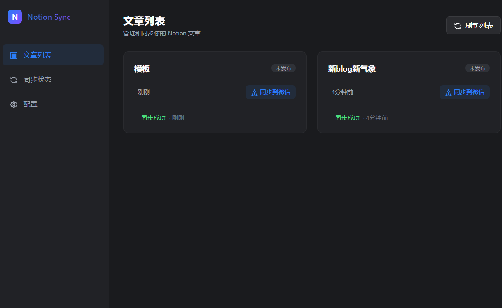

# Notion2PublicFlow

一个优雅的 Notion 文章同步到微信公众号的桌面应用。



## ✨ 功能特点

- 🔄 从 Notion 数据库自动同步文章
- 📝 智能转换为微信公众号格式
- 🎨 美观的界面设计
- 📊 实时同步状态显示
- ⚙️ 简单的配置管理
- 🔍 文章预览功能

## 🚀 快速开始

### 前置要求

- Node.js 16+
- npm 或 yarn
- Notion API Key
- 微信公众号 AppID 和 AppSecret

### 安装

1. 克隆仓库：
```bash
git clone https://github.com/Wheeeeeeeeels/zaka-notion2pubflow.git
cd zaka-notion2pubflow
```

2. 安装依赖：
```bash
npm install
# 或
yarn install
```

3. 启动应用：
```bash
npm run dev
# 或
yarn dev
```

## 📝 使用说明

1. 首次使用时，点击左侧导航栏的"配置"选项
2. 填入您的 Notion API Key 和数据库 ID
3. 填入微信公众号的 AppID 和 AppSecret
4. 保存配置后，返回文章列表页面
5. 点击"同步到微信"按钮即可发布文章

## ⚙️ 配置说明

### Notion 配置
- **API Key**: 在 [Notion Integrations](https://www.notion.so/my-integrations) 页面获取
- **数据库 ID**: 从您的 Notion 数据库 URL 中获取

### 微信公众号配置
- **AppID**: 在微信公众平台的开发配置中获取
- **AppSecret**: 在微信公众平台的开发配置中获取

## 🔧 开发指南

### 构建应用
```bash
npm run build
# 或
yarn build
```

### 目录结构
```
src/
├── main/          # Electron 主进程
├── renderer/      # 前端界面
└── shared/        # 共享类型和工具
```

## 🤝 贡献指南

1. Fork 本仓库
2. 创建您的特性分支 (git checkout -b feature/AmazingFeature)
3. 提交您的更改 (git commit -m 'Add some AmazingFeature')
4. 推送到分支 (git push origin feature/AmazingFeature)
5. 打开一个 Pull Request

## 📄 许可证

本项目采用 MIT 许可证 - 查看 [LICENSE](LICENSE) 文件了解详情

## 📱 联系方式

- 作者：Wheeeeeeeeels
- 邮箱：wheels.cs.work@gmail.com

## 🙏 致谢

- [Electron](https://www.electronjs.org/)
- [Notion API](https://developers.notion.com/)
- [微信公众平台](https://mp.weixin.qq.com/)

## 📝 更新日志

### v1.0.0 (2024-04-23)
- ✨ 首次发布
- 🎉 支持 Notion 文章同步到微信公众号
- 🌈 美观的用户界面
- ⚡️ 实时同步状态
- 🔧 简单的配置管理